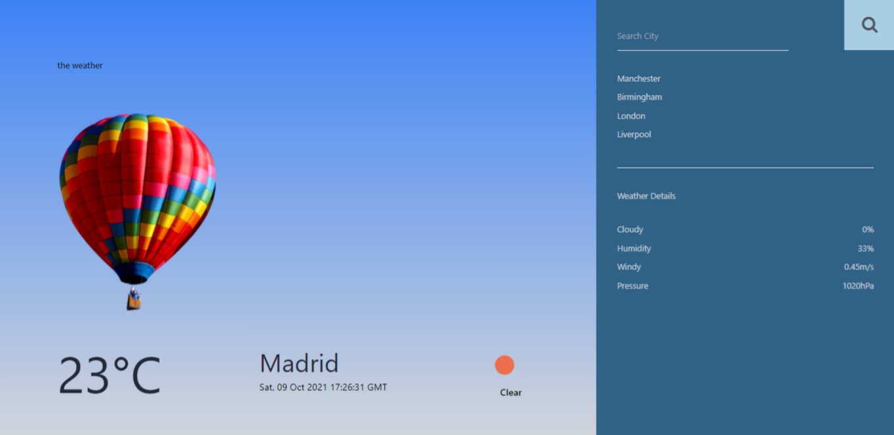
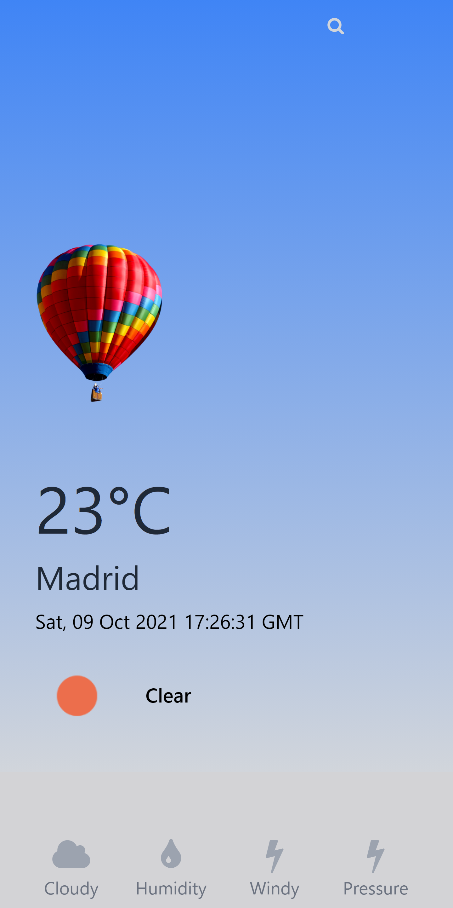
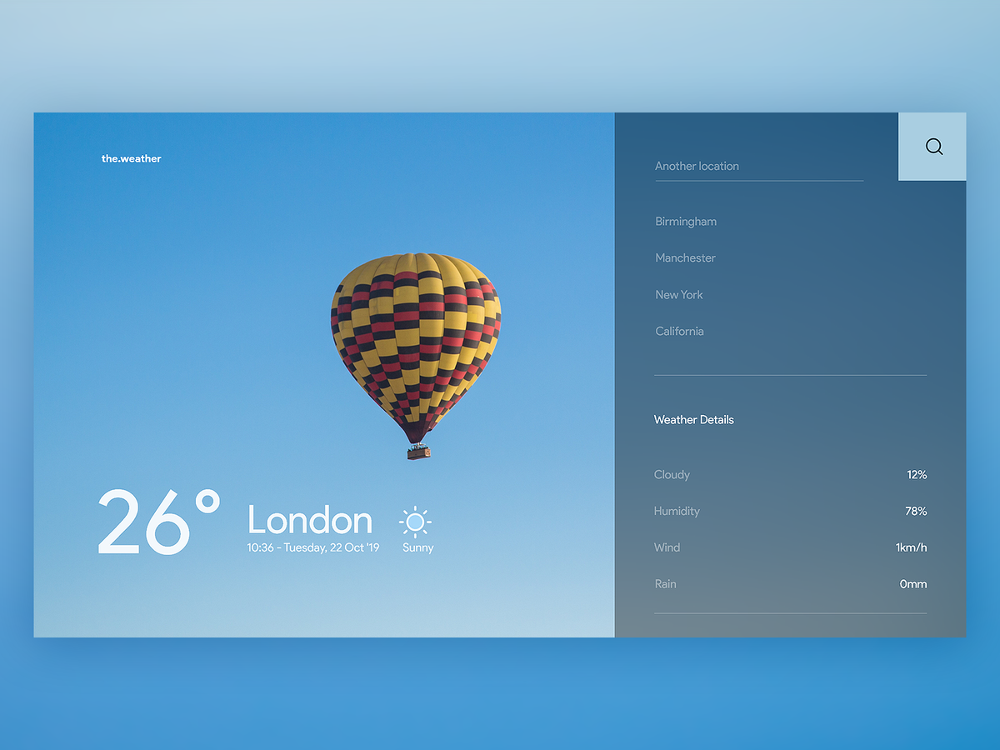

# Weather Web App

This is a web application that provide city current weather stats

## Features
- Search a city for its weather condition
- Save city to local storage 
- Display various weather details (Temperature, Humidity etc)
- Display error messages

### Preview

### Screenshot
# Desktop View:  :point_down::point_down::point_down: 

            
# Mobile View:  :point_down::point_down::point_down: 

   
  

  
### Links

- [Live Site URL](https://am-weather-app.netlify.app/)
- [Youtube] Coming soon

### Built with

- Semantic HTML5 markup
- Tailwind CSS
- Vanilla JS(Fetch API, Promises, Async & Await...)

## Design
  ### Inspired by Arthur K's "Minimalist weather app design"
 
 

  
 Check it out:  :point_down::point_down::point_down: 
 [Dribbble](https://dribbble.com/shots/7767460-Weather-App-Website?utm_source=pinterest&utm_campaign=pinterest_shot&utm_content=Weather+App+Website&utm_medium=Social_Share)
## Author
### Contact Me:  :point_down::point_down::point_down: 
- [Instagram](https://www.instagram.com/albert_sigsbert/)
- [LinkedIn](https://www.linkedin.com/in/albertsigsbert/)
- [Twitter](https://twitter.com/albert_sigsbert)
- [Design]()
